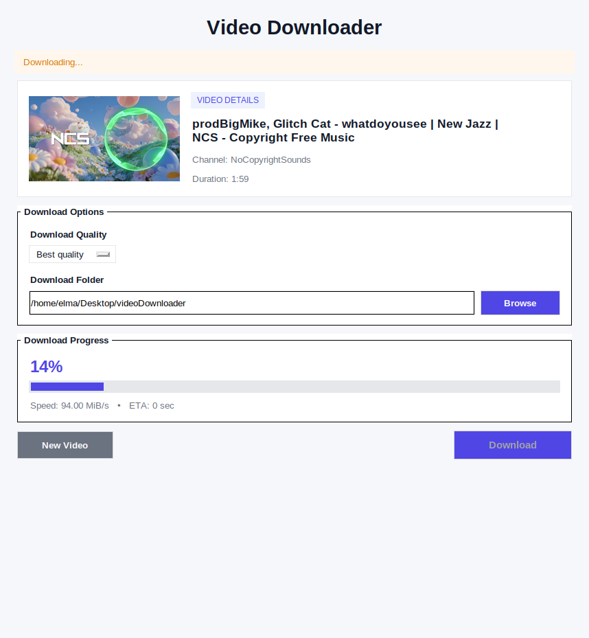

# YouTube Video Downloader

A modern desktop YouTube downloader built with Python, Tkinter, and yt-dlp.

This application allows downloading videos or audio from YouTube with dynamic quality detection, thumbnail preview, progress tracking, and download history support.

---

## Features

* Fetch video info before download
* Dynamic quality detection based on available formats
* Download as MP4 video or MP3 audio
* Automatic thumbnail preview
* Real-time download progress
* Download history tracking
* Right-click history menu:

  * Open file
  * Open folder
  * Remove from history
* Modern polished desktop interface

---

## Technologies Used

* Python
* Tkinter
* yt-dlp
* Pillow
* requests

---

## Installation

Clone repository:

```bash
git clone https://github.com/ElmaYiyenAdam/python-media-downloader.git
cd python-media-downloader
```

Create virtual environment:

```bash
python3 -m venv venv
source venv/bin/activate
```

Install dependencies:

```bash
pip install -r requirements.txt
```

---

## Run

```bash
python main.py
```

---

## Requirements

Make sure ffmpeg is installed for high quality merging:

```bash
sudo apt install ffmpeg
```

---

## Screenshot

<p align="center">
  
</p>

---

## Future Improvements

* Playlist support
* Download cancel button
* Dark mode
* Better export options

---

## License

Personal project for educational and portfolio purposes.
